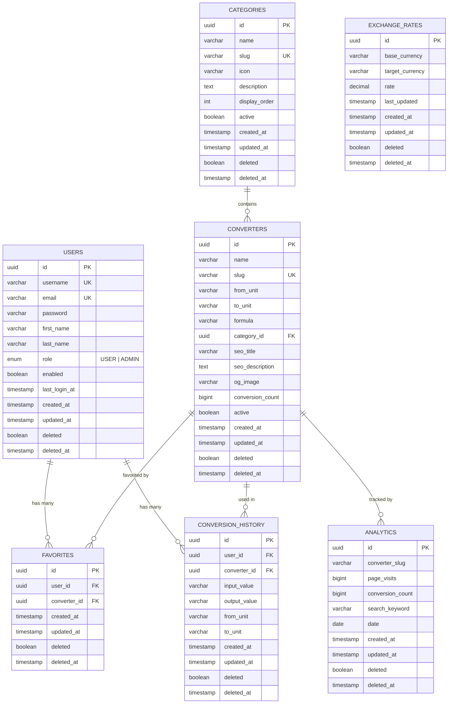

# Universal Converter Hub — Entity Relationship Diagram



## Table Descriptions

| Table | Purpose | Key Constraints |
|-------|---------|----------------|
| `users` | User accounts with roles | `username` UNIQUE, `email` UNIQUE |
| `categories` | Converter categories (Length, Weight, etc.) | `slug` UNIQUE |
| `converters` | Individual converter definitions | `slug` UNIQUE, FK to `categories` |
| `favorites` | User-converter favorites | UNIQUE(`user_id`, `converter_id`) |
| `conversion_history` | Logged conversion records | FK to `users`, FK to `converters` |
| `analytics` | Page visit and conversion tracking | UNIQUE(`converter_slug`, `date`) |
| `exchange_rates` | Cached currency exchange rates | UNIQUE(`base_currency`, `target_currency`) |

## Indexes

```sql
-- Users
CREATE INDEX idx_users_email ON users(email);
CREATE INDEX idx_users_username ON users(username);
CREATE INDEX idx_users_deleted ON users(deleted);

-- Categories
CREATE INDEX idx_categories_slug ON categories(slug);
CREATE INDEX idx_categories_active ON categories(active, deleted);
CREATE INDEX idx_categories_display_order ON categories(display_order);

-- Converters
CREATE INDEX idx_converters_slug ON converters(slug);
CREATE INDEX idx_converters_category ON converters(category_id);
CREATE INDEX idx_converters_active ON converters(active, deleted);
CREATE INDEX idx_converters_conversion_count ON converters(conversion_count DESC);
CREATE INDEX idx_converters_name_search ON converters(name);

-- Favorites
CREATE INDEX idx_favorites_user ON favorites(user_id);
CREATE INDEX idx_favorites_converter ON favorites(converter_id);
CREATE UNIQUE INDEX idx_favorites_user_converter ON favorites(user_id, converter_id);

-- Conversion History
CREATE INDEX idx_history_user ON conversion_history(user_id);
CREATE INDEX idx_history_created ON conversion_history(created_at DESC);
CREATE INDEX idx_history_user_created ON conversion_history(user_id, created_at DESC);

-- Analytics
CREATE INDEX idx_analytics_slug ON analytics(converter_slug);
CREATE INDEX idx_analytics_date ON analytics(date);
CREATE UNIQUE INDEX idx_analytics_slug_date ON analytics(converter_slug, date);
CREATE INDEX idx_analytics_page_visits ON analytics(page_visits DESC);

-- Exchange Rates
CREATE INDEX idx_exchange_base ON exchange_rates(base_currency);
CREATE UNIQUE INDEX idx_exchange_pair ON exchange_rates(base_currency, target_currency);
```

## Audit Fields (All Tables)

Every table includes the following audit fields managed by JPA:
- `created_at` — Set automatically on insert (`@CreationTimestamp`)
- `updated_at` — Set automatically on update (`@UpdateTimestamp`)
- `deleted` — Soft delete flag (default: `false`)
- `deleted_at` — Timestamp of soft deletion
